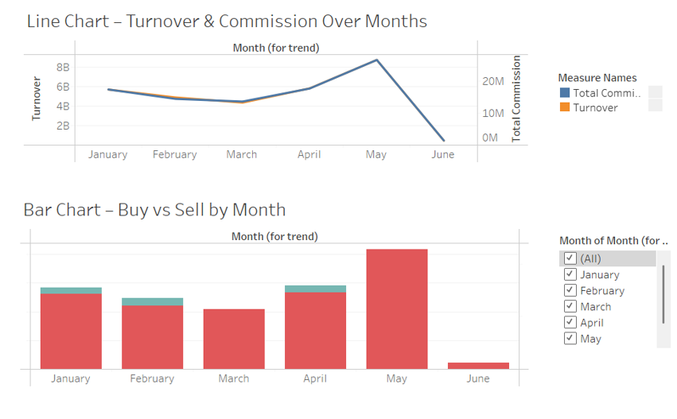
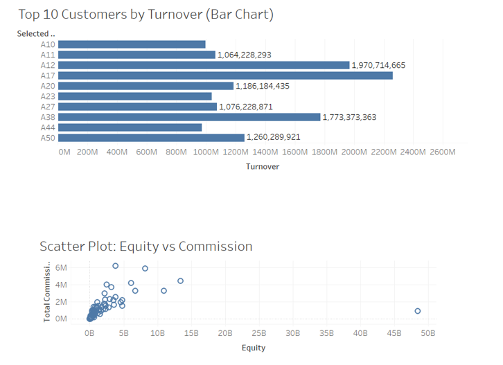
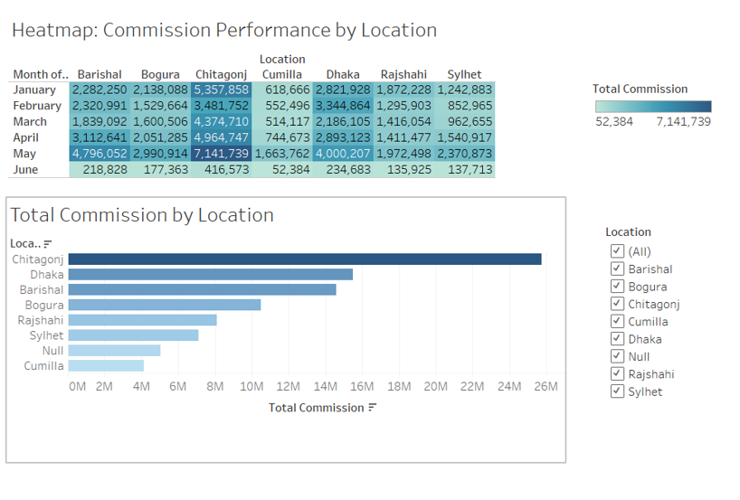

# 📈 Tableau Trading Data Analysis Dashboard

Welcome to the **Tableau Trading Data Analysis Dashboard**!  
This project utilizes **Tableau** to explore trading activity, customer behavior, and regional performance using transactional trading data.
You can also have a look live Dashboard Tour by downloading the Dashboard Tour.ZIP file
---

## 📊 Project Overview

**🎯 Objective:**  
Develop an interactive Tableau dashboard to:

- Track key daily trading KPIs: **Turnover**, **Commission**, **Net Inflow/Outflow**
- Highlight top-performing customers and Relationship Managers (RMs)
- Compare regional activity across different locations

**📁 Data Source:** `trading_data.xlsx`  
Key fields include:

- `RM ID` – Relationship Manager Identifier  
- `Customer ID` – Unique customer identifier  
- `Trading Date` – Date of transaction  
- `Total Buy / Sell` – Daily trade amounts  
- `Total Commission` – Daily commission earned  
- `Turnover` – Sum of Total Buy + Total Sell  
- `Equity` – End-of-day customer equity  
- `Deposit / Withdraw` – Cash inflows/outflows  
- `Transfer In / Out` – Fund transfers  
- `Location` – Customer's geographic location  
---
## 📸 Dashboard Preview

### 🧭 Overview Page

### 👤 Customer & RM Analysis

### 🗺️ Location Performance

## 🔍 What’s Included in the Dashboard

### 📌 Overview Page
- KPI cards for:
  - **Total Turnover**
  - **Total Commission**
  - **Net Inflow**
  - **Active Customers**
- Time-series line charts for **Turnover** and **Net Inflow** trends

### 👤 Customer & RM Analysis
- Top 10 customers by **Turnover** and **Commission**
- RM performance bar charts:
  - **Commission Earned**
  - **Average Customer Equity**
- Interactive filters for **Date**, **RM ID**, and **Customer ID**

### 🗺️ Location Analysis
- **Geographic Heatmap** of turnover and net inflow by region
- **Ranked Table** of location performance with conditional formatting
- 
### Created by Md Shihab Reza
📅 July 2025
